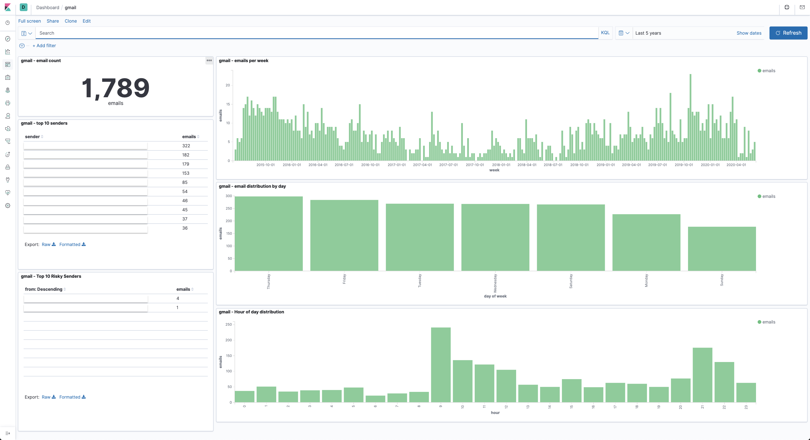

# gmail-sync



Use the gmail api to export your emails into elasticsearch for visualization by kibana.

This is a modernized version of [this medium article](https://medium.com/@orweinberger/analyze-and-visualize-your-gmail-inbox-using-elasticsearch-and-kibana-88cb4e373c13) written in golang and using elasticsearch 7.x

## Setting up Elasticsearch

Ensure that you have version 7.x of elasticsearch and kibana running on your local machine. Once both are running you have to import the index template to set the schema for the gmail data we will insert to elasticsearch. Run this command in the `gmail-sync` directory

## To run:

1. Ensure you have [elasticsearch](https://www.elastic.co/downloads/elasticsearch) and [kibana](https://www.elastic.co/downloads/kibana) `7.x` running locally. I use [docker](https://docs.docker.com/engine/install/) and [docker-compose](https://docs.docker.com/compose/install/) for easily installing and running elasticsearch and kibanas.
1. Ensure you have [golang](https://golang.org/) installed
1. run
   ```
   git clone https://github.com/grindlemire/gmail-sync
   ```
1. Ensure you have the gmail api turned on for the email you want to sync. See [this article](https://developers.google.com/gmail/api/quickstart/go) for how to enable the api. Make sure the `credentials.json` file is placed in the `gmail-sync` directory.
1. we have to set the index template for the new data in elasticsearch. Run the following command in the `gmail-sync` directory (elasticsearch needs to be running on your machine for this to work):
   ```
   curl -X PUT "http://localhost:9200/_template/gmail_template" -H 'Content-Type:application/json' -d @template.json
   ```
1. run `go run main.go` in the gmail-sync directory
1. To import the kibana dashboard go to the "management" screen in kibana (you can find it on the toolbar on the lefthand side of the screent), then go to "saved objects", then "import" and select `dashboard.ndjson` (in this repository).

## Note

Depending on how many emails you have it may burn through your allowed gmail api quota and you will not be able to sync any more emails.

I print out the current page token that is being used (it keeps track of which page of results you are looking at) so you can start at that token when you next have quota available. To start at a specific page (rather than the beginning of your messages) simply specify the token via `-t` command line flag. Example:

```
./gmail-sync -t abcdefhij
```
